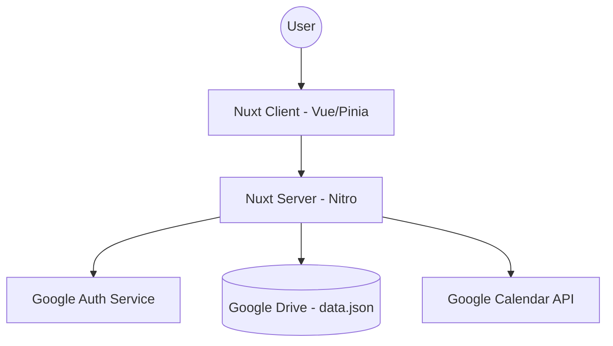
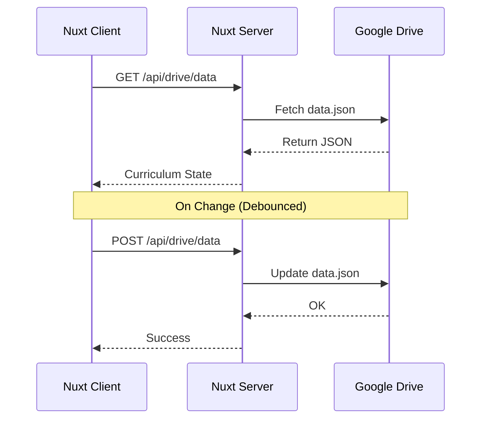
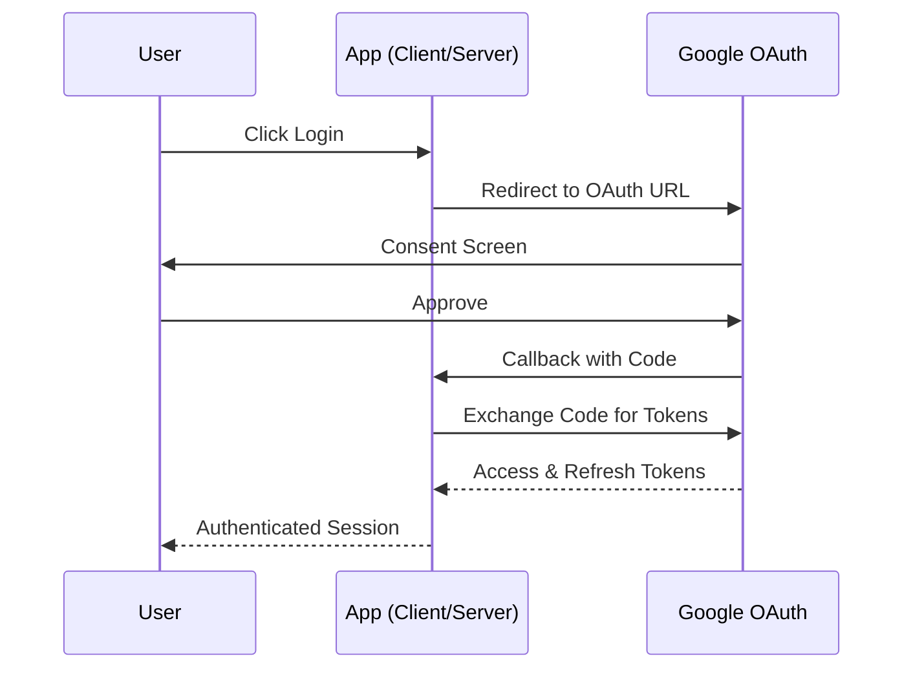

# Course Tracker App

A modern, structured curriculum tracker designed to help developers transition into Software Architects. This application synchronizes your progress across your Google workspace, utilizing Google Drive for data storage and Google Calendar for scheduling study sessions.

## 🚀 Features

- **Structured Curriculum**: Built-in pathways for LLD (Low-Level Design), HLD (High-Level Design), and AWS.
- **Google Drive Integration**: Your progress is stored as a `data.json` file in your personal Google Drive, ensuring privacy and persistence.
- **Calendar Scheduling**: Schedule study sessions directly to your Google Calendar with one click.
- **Management Portal**: Full control over your study goals, pathways, sections, and topics.
- **Assignment Submission**: Track your practical learning by linking GitHub repositories to specific topics.
- **Real-time Sync**: Debounced auto-saving to Google Drive and manual sync options.

## 🛠 Tech Stack

- **Frontend**: Nuxt 4, Vue 3, Pinia (State Management), VueUse.
- **UI Components**: Bootstrap Vue Next, Lucide Icons, Vue Sonner (Notifications).
- **Backend API**: Nuxt Server Routes (Nitro).
- **Integrations**: Google Drive API, Google Calendar API, Google Auth Library.

## 🏗 Architecture

### System Overview

The app follows a client-server architecture where the Nuxt server acts as a middleware for Google APIs.



### Data Synchronization Flow

The curriculum data is loaded from Google Drive on application start and saved back whenever changes occur.



### Authentication Flow

Uses OAuth2 to securely access the user's Google account.



## 🏁 Getting Started

### Prerequisites

- Node.js (Latest LTS)
- Google Cloud Project with Drive and Calendar APIs enabled
- OAuth2 Client Credentials

### Installation

1. Clone the repository:

   ```bash
   git clone <repository-url>
   cd course-tracker
   ```

2. Install dependencies:

   ```bash
   npm install
   ```

3. Set up environment variables:
   Create a `.env` file in the root based on `.env.example`:

   ```env
   GOOGLE_CLIENT_ID=your_id
   GOOGLE_CLIENT_SECRET=your_secret
   GOOGLE_REDIRECT_URI=http://localhost:3000/api/auth/callback
   ```

4. Run the development server:
   ```bash
   npm run dev
   ```

## 📂 Project Structure

- `app/`: Frontend application code.
  - `pages/`: Nuxt pages (Dashboard, Manage, Login).
  - `stores/`: Pinia stores for Auth and Curriculum state.
  - `services/`: API client services.
- `server/`: Backend API routes and utilities.
  - `api/`: Endpoint implementations (Auth, Drive, Calendar).
  - `utils/`: Helper functions for Google API interaction.
- `public/`: Static assets and base `data.json`.

---

_Built with ❤️ for aspiring architects._
